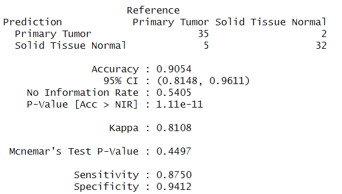
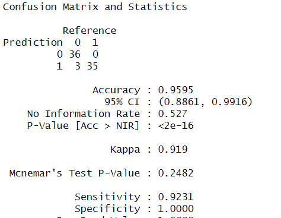
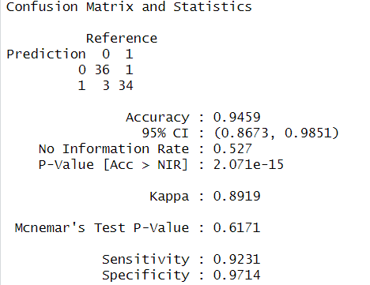
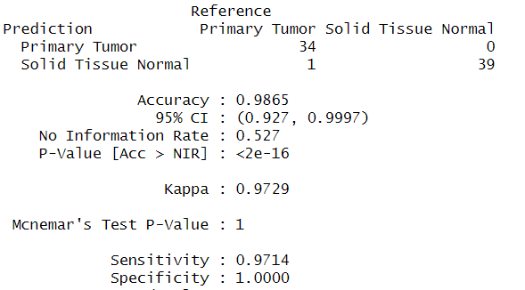
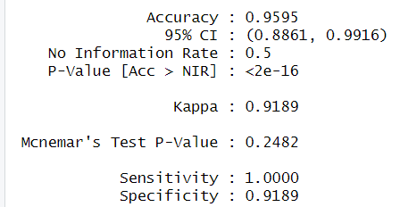

```{r include=FALSE}
library(tidyverse)
library(lattice)
library(caret)
library(class)
library(gmodels)
library(psych)
library(DynamicCancerDriverKM)
library(rpart)
library(randomForest)
library(e1071)
library(kernlab)
```

<<<<<<< HEAD
#### Step 1: Installing the DynamicCancerDriverKM Package

Las librerías utilizadas para concluir este proyecto son las siguientes
(usar el comando **`library()`**) \>\
tidyverse-caret-class-gmodels-DynamicCancerDriverKM-rpart-randomForest-e1071-kernlab

*Nota: La instalación de la librería "DynamicCancerDriverKM" y más
información en el siguiente enlace:
<https://github.com/AndresMCB/DynamicCancerDriverKM>*

Este **proyecto aplica** los modelos de aprendizaje automático
supervisado a un conjunto de datos de expresiones genéticas del cáncer,
con el fin de clasificar con precisión distintos tipos de cáncer y
predecir resultados clínicos. Consiste en entrenar modelos sobre el
conjunto de datos de la librería mencionada anteriormente etiquetando
los niveles de expresión de los genes como características y el tipo o
estadio de cáncer como objetivo.

Tipo o estadio del cáncer como variable objetivo.

**Modelos de aprendizaje:** K-nn, Regresión lineal, arboles de decisión,
arboles aleatorios, soporte vectorial

Nota: Para visualizar el código, como fases entrenamiento, filtros,
selección de genes y construcción de los modelos ver el archivo -
`Test.R`

#### Step 2: Creating a Unified Gene Expression Matrix

Se creo una única matriz fusionando los datos de TCGA_BRCA_Normal.rdata
y TCGA_BRCA_PT.rdata, esta cuanta con la columna **`Sample_type`**
nuestra variable objetivo. De la siguiente manera:

=======
>>>>>>> 94b89f9010ea4d337d4f45b6b69746919962aa85
```{r}
normaldata <-(DynamicCancerDriverKM::BRCA_normal)
dataPt <-(DynamicCancerDriverKM::BRCA_PT)
final_data <- bind_rows(normaldata, dataPt)

rate_min_10 <- final_data %>%
<<<<<<< HEAD
               summarise_all(~ mean(. <400, na.rm = TRUE))

colmn_delate <- names(rate_min_10[, rate_min_10 >= 0.8])
data_filter <- final_data %>%
               select(-one_of(colmn_delate))
```

Relacion con los datos de cáncer de mama (BRCA). Se concectan
verticalmente los conjuntos de datos usando la función **`bind_rows`** y
se almacenan en **`final_data`**. Luego, se calcula la media de cada
columna que contiene valores inferiores a 400, y se filtran las columnas
que tienen una media superior al 80% de las observaciones.

Realizando una limpieza y filtrado de datos, eliminando las columnas que
tienen una alta proporción de valores superiores a 400.

#### Step 3: Filtering Gene Expression Data

La manipulación de datos relacionados con una red de (PPI).
Inicialmente, se crea una copia del conjunto de datos original llamado
**`data_filter`** para preservar la integridad del dataset original.
Luego, se carga un conjunto de datos PPI desde el paquete
**`DynamicCancerDriverKM`** y se realiza una serie de transformaciones
utilizando las funciones de la librería Tidyverse. Se convierten las
columnas que representan genes de nodos de entrada y salida en un
formato más largo y se calcula la frecuencia de cada combinación.
Posteriormente, se organiza la información en un formato más ancho.
Además, se crea una nueva variable llamada **`total_mode`** que
representa la suma de las frecuencias de nodos de entrada y salida, y se
ordena el conjunto de datos en orden descendente según esta variable.

```{r include=FALSE}
data_filter2 <- data_filter
data_PPI<-(DynamicCancerDriverKM::PPI)

data_PPIn <- data_PPI %>% pivot_longer(cols = c(`Input-node Gene Symbol`, 
                         `Output-node Gene Symbol`), names_to = "variable", 
                          values_to = "gen") %>% 
                          group_by(gen, variable) %>%
                          summarise(frecuencia = n()) %>%
                          pivot_wider(names_from = variable, values_from = frecuencia, values_fill = 0)

data_PPInR <- data_PPIn %>% 
              mutate(total_mode = `Input-node Gene Symbol` + `Output-node Gene Symbol`) %>%
              select(total_mode) %>%
              arrange(desc(total_mode))
```

*Se visualiza los primeros 10 datos*

```{r}
print(data_PPInR %>% head(10))
```

#### Step 4: Selecting Genes Based on the PPI Network

En este paso se realiza un proceso de manipulación de datos para
facilitar la posterior selección y la utilización de un conjunto de
predictores en un análisis. Primero, se extraen los nombres de las
columnas relevantes del conjunto de datos **`data_filter`** desde la
columna 8 hasta la última y se almacenan en **`data_filter_x`**. Luego,
se utiliza la función **`changeGeneId`** del paquete **`AMCBGeneUtils`**
para convertir los identificadores de genes en **`data_filter_x`** desde
el formato "Ensembl.ID". Los correspondientes identificadores de
símbolos de genes "HGNC.symbol". Los nuevos nombres de genes obtenidos
se asignan a las columnas correspondientes en el conjunto de datos
original **`data_filter`**. Después, se extraen los nombres actualizados
de las columnas y se almacenan en **`final_data_gen`**.

A continuación, se filtran las filas del conjunto de datos
**`data_PPInR`** para incluir solo aquellas cuyos nombres de genes
coinciden con los nombres actualizados presentes en
**`final_data_gen`**, resultando en un nuevo conjunto de datos llamado
**`data_PPInR_filtrado`**.

```{r}
=======
  summarise_all(~ mean(. <400, na.rm = TRUE))
```


```{r}
colmn_delate <- names(rate_min_10[, rate_min_10 >= 0.8])

data_filter <- final_data %>%
  select(-one_of(colmn_delate))

data_filter2 <- data_filter

data_PPI<-(DynamicCancerDriverKM::PPI)

data_PPIn <- data_PPI %>%
  pivot_longer(cols = c(`Input-node Gene Symbol`, `Output-node Gene Symbol`), names_to = "variable", values_to = "gen") %>%
  group_by(gen, variable) %>%
  summarise(frecuencia = n()) %>%
  pivot_wider(names_from = variable, values_from = frecuencia, values_fill = 0)

data_PPInR <- data_PPIn %>%
  mutate(total_mode = `Input-node Gene Symbol` + `Output-node Gene Symbol`) %>%
  select(total_mode) %>%
  arrange(desc(total_mode))

print(data_PPInR)

>>>>>>> 94b89f9010ea4d337d4f45b6b69746919962aa85
data_filter_x<-colnames(data_filter)[ 8:ncol(data_filter)]
aux2 <- AMCBGeneUtils::changeGeneId(data_filter_x, from = "Ensembl.ID")

names(data_filter)[8:12631] <- aux2$HGNC.symbol

final_data_gen <- colnames(data_filter)

data_PPInR_filtrado <- data_PPInR %>%
<<<<<<< HEAD
                       filter(gen %in% final_data_gen)
```

se seleccionan los primeros 100 nombres de genes de la primera columna
de **`data_PPInR_filtrado`** y se convierten en un vector de caracteres
llamado **`Predictors`**.

```{r}
Predictors <- as.vector(head(data_PPInR_filtrado[, 1], 100))
Predictors <- as.character(unlist(Predictors))
```

#### Step 5: Building Machine Learning Models

**k-NN model**

Se establece una semilla aleatoria para garantizar reproducibilidad del
codigo. Se crea un nuevo conjunto de datos llamado **`data2_filter`**
mediante la selección aleatoria de 123 observaciones por grupo de
"sample_type" con reemplazo. A continuación, se genera un índice de
muestra para dividir el conjunto de datos en conjuntos de entrenamiento
y prueba en una proporción del 70-30. Los datos de entrenamiento
(**`train.data`**) y prueba (**`test.data`**) se seleccionan en base a
este índice.

Se convierte la variable categórica "sample_type" en factores en ambos
conjuntos, lo que es esencial para muchos modelos de aprendizaje
automático en R.

```{r include=FALSE}
colnames(data_filter)[is.na(colnames(data_filter))] <- paste0("xs", ... = seq_along(colnames(data_filter) == ""))

set.seed(13)
data2_filter <- data_filter %>%
                group_by(sample_type) %>%
                sample_n(123, replace = TRUE) %>%
                ungroup()

sample.index <- sample(1:nrow(data2_filter), nrow(data2_filter) * 0.7, replace = FALSE)
train.data <- data2_filter[sample.index, c(Predictors, "sample_type"), drop = FALSE]
test.data <- data2_filter[-sample.index, c(Predictors, "sample_type"), drop = FALSE]

```

```{r}
=======
  filter(gen %in% final_data_gen)
```


# k-NN model
```{r}
Predictors <- as.vector(head(data_PPInR_filtrado[, 1], 100))
Predictors <- as.character(unlist(Predictors))

colnames(data_filter)[is.na(colnames(data_filter))] <- paste0("xs", seq_along(colnames(data_filter) == ""))
set.seed(13)

data2_filter <- data_filter %>%
  group_by(sample_type) %>%
  sample_n(123, replace = TRUE) %>%
  ungroup()

sample.index <- sample(1:nrow(data2_filter), nrow(data2_filter) * 0.6, replace = FALSE)

train.data <- data2_filter[sample.index, c(Predictors, "sample_type"), drop = FALSE]
test.data <- data2_filter[-sample.index, c(Predictors, "sample_type"), drop = FALSE]

>>>>>>> 94b89f9010ea4d337d4f45b6b69746919962aa85
train.data$sample_type <- factor(train.data$sample_type)
test.data$sample_type <- factor(test.data$sample_type)
```

<<<<<<< HEAD
**Train the k-NN model**

Se introduce la librería **`caret`** para realizar una validación
cruzada y optimizar los parámetros del modelo k-NN. Primero, se
establece un control de entrenamiento (**`ctrl`**) con el método de
validación cruzada (cv) y una proporción de 0.7 para la partición de los
datos. Luego, se utiliza la función **`train()`** para construir y
ajustar el modelo k-NN. La fórmula **`sample_type ~ .`** indica que la
variable objetivo es "sample_type" y se utilizan todas las demás
variables como predictores.

El método de clasificación k-NN se especifica con el argumento
**`method`**. Se utiliza el control de entrenamiento definido
previamente (**`trControl`**) para realizar la validación cruzada.
Además, se aplica la normalización de rango
(**`preProcess = c("range")`**). El parámetro **`tuneLength`** indica
cuántos valores diferentes de k se evaluarán durante la búsqueda de
hiperparámetros, estableciéndose en 50 en este caso.

```{r}
ctrl <- trainControl(method = "cv", p = 0.7)

=======
# Train the k-NN model
```{r}
ctrl <- trainControl(method = "cv", p = 0.6)
>>>>>>> 94b89f9010ea4d337d4f45b6b69746919962aa85
knnFit <- train(sample_type ~ .,
                data = train.data,
                method = "knn",
                trControl = ctrl,
                preProcess = c("range"),  # c("center", "scale") for z-score
                tuneLength = 50)
<<<<<<< HEAD

=======
```

# Plot k-NN model
```{r}
>>>>>>> 94b89f9010ea4d337d4f45b6b69746919962aa85
plot(knnFit)
knnPredict <- predict(knnFit, newdata = test.data)
```

<<<<<<< HEAD
Create the confusion matrix for k-NN

```{r include=FALSE}
confusionMatrix(data = knnPredict, 
                reference = test.data$sample_type)
```

El accuracy que sugiere que aproximadamente el 90.54% de las
predicciones realizadas por el modelo son correctas. El índice Kappa,
que tiene en cuenta la posibilidad de aciertos al azar, es del 81.08%,
lo que indica un buen nivel de acuerdo más allá del azar. La
sensibilidad del 87.50% destaca la capacidad del modelo para identificar
positivos reales, mientras que la especificidad del 94.12% indica una
fuerte capacidad para identificar negativos reales

{width="344"}

**Linear regression**

Se transforma la variable objetivo **`sample_type`** a una variable
binaria asignando el valor 1 si es "Solid Tissue Normal" y 0 en caso
contrario. Luego, se seleccionan las columnas relevantes, incluyendo las
características predictoras (**`Predictors`**) y la variable objetivo,
para los conjuntos de entrenamiento y prueba. A continuación, se ajusta
el modelo de regresión lineal (**`ins_model`**) utilizando la función
**`lm()`** en base a los datos de entrenamiento. Finalmente, se imprime
un resumen del modelo utilizando **`summary(ins_model)`**

```{r include=FALSE}
data2_filter <- data2_filter %>%
                mutate(sample_type = ifelse(sample_type == "Solid Tissue Normal", 1, 0))

train.data <- data2_filter[sample.index, c(Predictors, "sample_type"), drop = FALSE]
test.data <- data2_filter[-sample.index, c(Predictors, "sample_type"), drop = FALSE]

ins_model <- lm(sample_type ~ ., data = train.data) # Fit linear regression model

summary(ins_model)
```

| **\*\*\*** | **CREBBP, ESR1, JUN, TRAF2, ATXN1, LYN, EEF1A1, MDFI, PRKCD, HCK, VCL**       |
|---------------|---------------------------------------------------------|
| \*\*       | RB1, FYN, TK1, MAPK6, SHC1, SMN1, CALM1, BRCA1, ACTB, CBL, RAF1, NCOR1, TRAF6 |
| \*         | SMAD2, VIM, ANXA7, PTK2, ATN1, XRCC6, MYC, CAV1, STAT1, PTPN6, SRF, APP, PXN  |
| .          | EGFR, CSNK2B, SETDB1, YWHAB, TBP, RXRA, TPN11, NR3C1, TLE1, COPS6, SKIL, PIN1 |
|            | Residual standard error: 0.1238                                               |
|            | Multiple R-squared: 0.9747, Adjusted R-squared: 0.939                         |

De los 100 predictores, se asume la cantidad de asteriscos mas
significativo acorde a la variable objetivo para su prediccion. Ademas,
El Residual Standard Error de 0.1238 mide la dispersión de los datos,
indicando qué tan bien las observaciones se ajustan al modelo. El
Multiple R-squared de 0.9747 señala la proporción de la variabilidad en
la variable objetivo que es explicada por el modelo.

```{r include=FALSE}
# Train the linear regression model
=======
# Create the confusion matrix for k-NN
```{r}
confusionMatrix(data = knnPredict, reference = test.data$sample_type)
```

# Linear regression
```{r}
data2_filter <- data2_filter %>%
  mutate(sample_type = ifelse(sample_type == "Solid Tissue Normal", 1, 0))

train.data <- data2_filter[sample.index, c(Predictors, "sample_type"), drop = FALSE]
test.data <- data2_filter[-sample.index, c(Predictors, "sample_type"), drop = FALSE]
```

# Fit linear regression model
```{r}
ins_model <- lm(sample_type ~ ., data = train.data)
```

# Summary of linear regression model
```{r}
summary(ins_model)
```

# Train the linear regression model
```{r}
>>>>>>> 94b89f9010ea4d337d4f45b6b69746919962aa85
train.control <- trainControl(method = "cv", number = 10)
model <- train(sample_type ~ .,
               data = train.data,
               method = "lm",
               trControl = train.control)
```

<<<<<<< HEAD
**Summarize the results of linear regression model**

```{r}
print(model)
```

Los resultados de la regresión lineal indican que el modelo fue evaluado
en un conjunto de datos que consta de 172 muestras y utiliza 100
predictores para predecir la variable objetivo. El Root Mean Squared
Error (RMSE) de 0.4559756 mide la raíz cuadrada de la diferencia
promedio entre las predicciones del modelo y los valores reales, lo que
sugiere un ajuste razonable del modelo. El R cuadrado (Rsquared) de
0.5840365 representa la proporción de la variabilidad en la variable
objetivo que es explicada por el modelo, y el valor del 58.4% indica un
buen nivel de explicación. El Mean Absolute Error (MAE) de 0.2955811 es
la media de las diferencias absolutas entre las predicciones y los
valores reales, mostrando una precisión moderada.

**First Random Forest**

Se utiliza el algoritmo Random Forest (RF) con la función
**`randomForest()`** para construir un modelo (**`fit.rf`**) que predice
la variable objetivo **`sample_type`** basándose en un conjunto de
predictores. Luego, se realiza la predicción en el conjunto de prueba
(**`test.data`**) y se genera una tabla de contingencia para comparar
las predicciones con las clases reales.

Posteriormente, se emplea el algoritmo de Árboles de Decisión con la
función **`rpart()`**. Este modelo (**`fit`**) se construye utilizando
el método de análisis de varianza (ANOVA) para clasificación. Se
especifica el conjunto de predictores y la variable objetivo, y se
utiliza la validación cruzada con 10 folds (**`xval = 10`**). Este
método crea un árbol de decisión que se ajusta a los datos de
entrenamiento y puede predecir la variable objetivo en nuevos datos.

```{r include=FALSE}
fit.rf <- randomForest(sample_type ~ .,
                       data = data2_filter[, c(Predictors, "sample_type")])
prediction.rf <- predict(fit.rf, test.data)
table(test.data$sample_type, prediction.rf)

fit <- rpart(sample_type ~ .,
             method = "anova",
             data = data2_filter[, c(Predictors, "sample_type")],
             control = rpart.control(xval = 10))
```

=======
# Summarize the results of linear regression model
```{r}
print(model)

fit <- rpart(sample_type ~ .,
             method = "anova",
             data = data_filter[, c(Predictors, "sample_type")],
             control = rpart.control(xval = 10))
```

# Print the decision tree
```{r}
print(fit)
```

# Plot the decision tree
>>>>>>> 94b89f9010ea4d337d4f45b6b69746919962aa85
```{r}
rpart.plot::rpart.plot(fit)
```

<<<<<<< HEAD
**Soporte Vectorial**

Primero se lleva a cabo una búsqueda de hiperparámetros para el modelo
de Máquinas de Soporte Vectorial (SVM) mediante la función **`tune()`**
en R. El objetivo es ajustar el hiperparámetro de costo (**`cost`**)
para un kernel lineal. El modelo SVM se entrena utilizando el conjunto
de datos de entrenamiento **`train.data`** con la variable objetivo
**`sample_type`** y todas las demás variables predictoras representadas
por el símbolo **`.`**. La búsqueda de hiperparámetros se realiza para
valores específicos de **`cost`** (0.001, 0.01, 0.1, 1, 5, 10, 100). La
función **`tune()`** evalúa el rendimiento del modelo para cada valor de
**`cost`** utilizando validación cruzada u otro método de validación
definido. Al finalizar, **`tune_out`** contiene los resultados de la
búsqueda, permitiendo identificar el valor óptimo de **`cost`** que
maximiza el rendimiento del modelo SVM lineal en el conjunto de datos de
entrenamiento.

```{r include=FALSE}
# Convierte la variable de respuesta a factor si no lo está
data2_filter$sample_type <- as.factor(data2_filter$sample_type)

# Divide los datos en conjuntos de entrenamiento y prueba

=======
## First Random Forest
```{r}
fit.rf <- randomForest(sample_type ~ .,
                       data = data2_filter[, c(Predictors, "sample_type")])
prediction.rf <- predict(fit.rf, test.data)
table(test.data$sample_type, prediction.rf)
```

## Second Random Forest
```{r}
fit.rf <- randomForest(sample_type ~ .,
                       data = data2_filter[, c(Predictors, "sample_type")])

prediction.rf <- predict(fit.rf, test.data)
output <- data.frame(Actual = test.data$sample_type, Predicted = prediction.rf)
RMSE = sqrt(sum((output$Actual - output$Predicted)^2) / nrow(output))

print(head(output))
```

######vector
# Convierte la variable de respuesta a factor si no lo está
```{r}
data2_filter$sample_type <- as.factor(data2_filter$sample_type)
```

# Divide los datos en conjuntos de entrenamiento y prueba
```{r}
>>>>>>> 94b89f9010ea4d337d4f45b6b69746919962aa85
set.seed(13)
sample.index <- sample(1:nrow(data2_filter), nrow(data2_filter) * 0.7, replace = FALSE)
train.data <- data2_filter[sample.index, c(Predictors, "sample_type"), drop = FALSE]
test.data <- data2_filter[-sample.index, c(Predictors, "sample_type"), drop = FALSE]
```

<<<<<<< HEAD
*Realiza la búsqueda de hiperparámetros con e1071*

=======
# Realiza la búsqueda de hiperparámetros con e1071
>>>>>>> 94b89f9010ea4d337d4f45b6b69746919962aa85
```{r}
tune_out <- tune(svm,
                 sample_type ~ .,
                 data = train.data,
                 kernel = "linear",
                 ranges = list(cost = c(0.001, 0.01, 0.1, 1, 5, 10, 100)))
```

<<<<<<< HEAD
**Extraer el mejor modelo**

Este modelo se eligió según algún criterio específico de rendimiento,
como la precisión o el error, durante el proceso de ajuste de
hiperparámetros realizado anteriormente con la función **`tune()`**.

=======
# Extrae el mejor modelo
>>>>>>> 94b89f9010ea4d337d4f45b6b69746919962aa85
```{r}
best_model <- tune_out$best.model
```

<<<<<<< HEAD
```{r include=FALSE}
# Configura el modelo SVM con un kernel lineal utilizando los mejores hiperparámetros
svm_model <- svm(sample_type ~ ., data = train.data, kernel = "linear", cost = best_model[["cost"]])

# Realiza predicciones en el conjunto de prueba
svm_predict <- predict(svm_model, newdata = test.data)

# Evalúa el rendimiento del modelo
confusionMatrix(data = svm_predict, reference = test.data$sample_type)
```

{width="277"}

El accuracy del indica que aproximadamente el 95.95% de las predicciones
realizadas por el modelo son correctas. El índice Kappa, que tiene en
cuenta la posibilidad de aciertos al azar, es del 91.9%, lo que sugiere
un alto nivel de acuerdo más allá del azar. La sensibilidad del 92.31%
destaca la capacidad del modelo para identificar positivos reales,
mientras que la especificidad del 100% indica una fuerte capacidad para
identificar negativos reales.

```{r include=FALSE}
# Realiza la búsqueda de hiperparámetros con e1071
=======
# Configura el modelo SVM con un kernel lineal utilizando los mejores hiperparámetros
```{r}
svm_model <- svm(sample_type ~ ., data = train.data, kernel = "linear", cost = best_model[["cost"]])
```

# Realiza predicciones en el conjunto de prueba
```{r}
svm_predict <- predict(svm_model, newdata = test.data)
```

# Evalúa el rendimiento del modelo
```{r}
confusionMatrix(data = svm_predict, reference = test.data$sample_type)
```

# Realiza la búsqueda de hiperparámetros con e1071
```{r}
>>>>>>> 94b89f9010ea4d337d4f45b6b69746919962aa85
tune_out <- tune(svm,
                 sample_type ~ .,
                 data = train.data,
                 kernel = "radial",
                 ranges = list(cost = c(0.001, 0.01, 0.1, 1, 5, 10, 100)))

best_model <- tune_out$best.model
<<<<<<< HEAD
svm_model <- svm(sample_type ~ ., data = train.data, kernel = "radial", cost = best_model[["cost"]])
```

#### Step 6: Evaluate and Compare Models

**Evalúar el rendimiento del modelo**

Indica que aproximadamente el 94.59% de las predicciones realizadas por
el modelo son correctas. El índice Kappa, la posibilidad de aciertos al
azar, es del 89.1%, lo que sugiere un alto nivel de acuerdo más allá del
azar. La sensibilidad del 92.31% destaca la capacidad del modelo para
identificar positivos reales, mientras que la especificidad del 97.14%
indica una fuerte capacidad para identificar negativos reales.

```{r include=FALSE}
library(caret)
# Realiza predicciones en el conjunto de prueba
svm_predict <- predict(svm_model, newdata = test.data)
confusionMatrix(data = svm_predict, reference = test.data$sample_type)
```

{width="266"}

Ahora la carga del archivo de datos "ExperimentsBulk.rdata". Primero, se
obtiene la ruta del directorio del script en ejecución y se extrae el
directorio. Luego, se construye la ruta completa del archivo de datos
utilizando el directorio padre y el nombre del archivo. Finalmente, la
función **`load()`** se utiliza para cargar los datos desde el archivo
"ExperimentsBulk.rdata" en el entorno de trabajo de R.

```{r include=FALSE}
=======

svm_model <- svm(sample_type ~ ., data = train.data, kernel = "radial", cost = best_model[["cost"]])
```

# Realiza predicciones en el conjunto de prueba
```{r}
svm_predict <- predict(svm_model, newdata = test.data)
```

# Evalúa el rendimiento del modelo
```{r}
library(caret)
confusionMatrix(data = svm_predict, reference = test.data$sample_type)
```

##Segunda Parte
```{r}
>>>>>>> 94b89f9010ea4d337d4f45b6b69746919962aa85
folder<-dirname(rstudioapi::getSourceEditorContext()$path)
parentFolder <-dirname(folder)

DataBulks <- file.path(paste0(parentFolder, "/ExperimentsBulk.rdata"))
load(DataBulks)
ls()
<<<<<<< HEAD
```

```{r include=FALSE}
gen_scores <- results[["ENSG00000145675"]][["geneScore"]]
=======

gen_scores <- results[["ENSG00000145675"]][["geneScore"]]
View(gen_scores)

>>>>>>> 94b89f9010ea4d337d4f45b6b69746919962aa85
gen_scores2<- gen_scores%>%arrange(desc(score))
score_column <- gen_scores2$features
```

<<<<<<< HEAD
```{r}
print(gen_scores %>% head(10))
```

**Obténer la columna "features" de gen_scores2**

Los datos denominado **`gen_scores2`**. En primer lugar, se extraen los
valores de la columna "features" y se almacenan en la variable
**`features_column`**. Luego, se aplica la función **`changeGeneId`**
del paquete **`AMCBGeneUtils`** a los valores de esta columna,
convirtiendo los identificadores de genes de formato "Ensembl.ID" a sus
correspondientes símbolos "HGNC.symbol". La columna "features" en
**`gen_scores2`** se actualiza con estos nuevos símbolos de genes.
Posteriormente, se filtran las filas de **`gen_scores2`** para incluir
solo aquellas cuyos valores en la columna "features" coinciden con los
nombres de genes almacenados en **`final_data_gen`**, generando así un
nuevo conjunto de datos llamado **`gen_scores2_filter`**. Finalmente, se
seleccionan los primeros 100 valores de la columna "features" en
**`gen_scores2_filter`** y se almacenan en el vector **`Predictors_2`**.
En resumen, este código realiza la transformación de identificadores de
genes, filtra datos basándose en una lista específica de nombres de
genes y selecciona los primeros 100 nombres de genes resultantes para su
uso como predictores.

```{r include=FALSE}
features_column <- gen_scores2$features

# Aplica la función changeGeneId a los valores de la columna "features"
gen_scores2$features <- AMCBGeneUtils::changeGeneId(features_column, from = "Ensembl.ID")$HGNC.symbol

gen_scores2_filter <- gen_scores2 %>%
                      filter(features %in% final_data_gen)

Predictors_2 <- head(gen_scores2_filter$features, 100)

# Convierte a caracteres si es necesario
=======
# Obtén la columna "features" de gen_scores2
```{r}
features_column <- gen_scores2$features
```

# Aplica la función changeGeneId a los valores de la columna "features"
```{r}
gen_scores2$features <- AMCBGeneUtils::changeGeneId(features_column, from = "Ensembl.ID")$HGNC.symbol

gen_scores2_filter <- gen_scores2 %>%
  filter(features %in% final_data_gen) #2

Predictors_2 <- head(gen_scores2_filter$features, 100)
```

# Convierte a caracteres si es necesario
```{r}
>>>>>>> 94b89f9010ea4d337d4f45b6b69746919962aa85
Predictors_2 <- as.character(Predictors_2)

data2_filter2 <- data_filter %>%
  group_by(sample_type) %>%
  sample_n(123, replace = TRUE) %>%
  ungroup()

sample.index <- sample(1:nrow(data2_filter2), nrow(data2_filter2) * 0.7, replace = FALSE)

train.data <- data2_filter2[sample.index, c(Predictors_2, "sample_type"), drop = FALSE]
test.data <- data2_filter2[-sample.index, c(Predictors_2, "sample_type"), drop = FALSE]

train.data$sample_type <- factor(train.data$sample_type)
test.data$sample_type <- factor(test.data$sample_type)

<<<<<<< HEAD
# Train the k-NN model
=======
```

# Train the k-NN model
```{r}
>>>>>>> 94b89f9010ea4d337d4f45b6b69746919962aa85
ctrl <- trainControl(method = "cv", p = 0.7)
knnFit <- train(sample_type ~ .,
                data = train.data,
                method = "knn",
                trControl = ctrl,
                preProcess = c("range"),  # c("center", "scale") for z-score
                tuneLength = 50)
```

<<<<<<< HEAD
**Plot k-NN model**

=======

# Plot k-NN model
>>>>>>> 94b89f9010ea4d337d4f45b6b69746919962aa85
```{r}
plot(knnFit)
```

<<<<<<< HEAD
```{r include=FALSE}
# Make predictions with k-NN
knnPredict <- predict(knnFit, newdata = test.data)
# Create the confusion matrix for k-NN
confusionMatrix(data = knnPredict, reference = test.data$sample_type)

```

{width="328"}

Indica que aproximadamente el 98.65% de las predicciones realizadas por
el modelo son correctas. El índice Kappa, la posibilidad de aciertos al
azar, es del 97.29%, lo que sugiere un alto nivel de acuerdo más allá
del azar. La sensibilidad del 97.14% destaca la capacidad del modelo
para identificar positivos reales, mientras que la especificidad del
100% indica una fuerte capacidad para identificar negativos reales.

**Linear regression**

```{r include=FALSE}
=======
# Make predictions with k-NN
```{r}
knnPredict <- predict(knnFit, newdata = test.data)
```

# Create the confusion matrix for k-NN
```{r}
confusionMatrix(data = knnPredict, reference = test.data$sample_type)
```

# Linear regression
```{r}
>>>>>>> 94b89f9010ea4d337d4f45b6b69746919962aa85
data2_filter2 <- data2_filter2  %>%
  mutate(sample_type = ifelse(sample_type == "Solid Tissue Normal", 1, 0))

train.data <- data2_filter2[sample.index, c(Predictors, "sample_type"), drop = FALSE]
test.data <- data2_filter2[-sample.index, c(Predictors, "sample_type"), drop = FALSE]
<<<<<<< HEAD

ins_model <- lm(sample_type ~ ., data = train.data)

# Summary of linear regression model
summary(ins_model)
```

| \*\*\* | LCK, ACTB, NCOR2, PTN, STAT1                                     |
|--------------|---------------------------------------------------------|
| \*\*   | PIK3R1, MYC, PTPN6                                               |
| \*     | RB1, EGFR, CCDC85B, YWHAZ, SP1, ATXN1, YWHAB, PTPN11, KAT2B, APP |
| .      | CHD3                                                             |
|        | Residual standard error: 0.1584                                  |
|        | Multiple R-squared: 0.9585, Adjusted R-squared:0.9001            |

De acuerdo a los 100 predictores (reintegración del nuevo data-set) y
teniendo en cuenta la cantidad de asteriscos (\*) es más significativo
acorde a la variable objetivo para su predicción. Además, El Residual
Standard Error de 0.1584 mide la dispersión de los datos, indicando qué
tan bien las observaciones se ajustan al modelo. El Múltiple R-squared
de 0.958 señala la proporción de la variabilidad en la variable objetivo
que es explicada por el modelo.

```{r include=FALSE}
# Train the linear regression model
=======
```

# Fit linear regression model
```{r}
ins_model <- lm(sample_type ~ ., data = train.data)
```

# Summary of linear regression model
```{r}
summary(ins_model)
```

# Train the linear regression model
```{r}
>>>>>>> 94b89f9010ea4d337d4f45b6b69746919962aa85
train.control <- trainControl(method = "cv", number = 10)
model <- train(sample_type ~ .,
               data = train.data,
               method = "lm",
              trControl = train.control)
```

<<<<<<< HEAD
**Summarize the results of linear regression model**

```{r}
print(model)
```

```{r include=FALSE}
##arboles de decision
=======
# Summarize the results of linear regression model
```{r}
print(model)

```

##arboles de decision
```{r}
>>>>>>> 94b89f9010ea4d337d4f45b6b69746919962aa85
fit <- rpart(sample_type ~ .,
             method = "anova",
             data = data2_filter2[, c(Predictors, "sample_type")],
             control = rpart.control(xval = 10))
<<<<<<< HEAD
print(fit)
```

**Print the decision tree**

```{r}
# Plot the decision tree
rpart.plot::rpart.plot(fit)
```

**Bosques aleatorios**

```{r include=FALSE}
=======
```

# Print the decision tree
```{r}
print(fit)
```

# Plot the decision tree
```{r}
rpart.plot::rpart.plot(fit)
```

###### Bosques aleatorios
```{r}
>>>>>>> 94b89f9010ea4d337d4f45b6b69746919962aa85
fit.rf <- randomForest(sample_type ~ .,
                       data = data2_filter2[, c(Predictors, "sample_type")])
prediction.rf <- predict(fit.rf, test.data)
table(test.data$sample_type, prediction.rf)


fit.rf <- randomForest(sample_type ~ .,
                       data = data2_filter2[, c(Predictors, "sample_type")])


prediction.rf <- predict(fit.rf, test.data)
output <- data.frame(Actual = test.data$sample_type, Predicted = prediction.rf)
RMSE = sqrt(sum((output$Actual - output$Predicted)^2) / nrow(output))
<<<<<<< HEAD
```

```{r}
print(head(output))
```

####################################### 

```{r include=FALSE}
data2_filter2$sample_type <- as.factor(data2_filter2$sample_type)

set.seed(110)
=======

print(head(output))
```

#######################################
```{r}
data2_filter2$sample_type <- as.factor(data2_filter2$sample_type)


set.seed(123)
>>>>>>> 94b89f9010ea4d337d4f45b6b69746919962aa85
sample.index <- sample(1:nrow(data2_filter2), nrow(data2_filter2) * 0.7, replace = FALSE)
train.data <- data2_filter2[sample.index, c(Predictors, "sample_type"), drop = FALSE]
test.data <- data2_filter2[-sample.index, c(Predictors, "sample_type"), drop = FALSE]

<<<<<<< HEAD
=======

>>>>>>> 94b89f9010ea4d337d4f45b6b69746919962aa85
tune_out <- tune(svm,
                 sample_type ~ .,
                 data = train.data,
                 kernel = "linear",
                 ranges = list(cost = c(0.001, 0.01, 0.1, 1, 5, 10, 100)))

<<<<<<< HEAD
best_model <- tune_out$best.model
svm_model <- svm(sample_type ~ ., 
                 data = train.data, kernel = "linear", 
                 cost = best_model[["cost"]])

svm_predict <- predict(svm_model, 
                       newdata = test.data)

confusionMatrix(data = svm_predict, 
                reference = test.data$sample_type)
=======

best_model <- tune_out$best.model


svm_model <- svm(sample_type ~ ., data = train.data, kernel = "linear", cost = best_model[["cost"]])


svm_predict <- predict(svm_model, newdata = test.data)


confusionMatrix(data = svm_predict, reference = test.data$sample_type)
>>>>>>> 94b89f9010ea4d337d4f45b6b69746919962aa85

tune_out <- tune(svm,
                 sample_type ~ .,
                 data = train.data,
                 kernel = "radial",
                 ranges = list(cost = c(0.001, 0.01, 0.1, 1, 5, 10, 100)))

best_model <- tune_out$best.model

<<<<<<< HEAD
svm_model <- svm(sample_type ~ ., 
                 data = train.data, kernel = "radial", 
                 cost = best_model[["cost"]])

svm_predict <- predict(svm_model, 
                       newdata = test.data)

confusionMatrix(data = svm_predict,
                reference = test.data$sample_type)

# Realiza la búsqueda de hiperparámetros con e1071
=======
svm_model <- svm(sample_type ~ ., data = train.data, kernel = "radial", cost = best_model[["cost"]])

svm_predict <- predict(svm_model, newdata = test.data)


confusionMatrix(data = svm_predict, reference = test.data$sample_type)
```

# Realiza la búsqueda de hiperparámetros con e1071
```{r}
>>>>>>> 94b89f9010ea4d337d4f45b6b69746919962aa85
tune_out <- tune(svm,
                 sample_type ~ .,
                 data = train.data,
                 kernel = "sigmoid",
                 ranges = list(cost = c(0.001, 0.01, 0.1, 1, 5, 10, 100)))

best_model <- tune_out$best.model

<<<<<<< HEAD
svm_model <- svm(sample_type ~ ., 
                 data = train.data, kernel = "sigmoid", 
                 cost = best_model[["cost"]])
```

#### Step 7: Results Discussion

**Realiza predicciones en el conjunto de prueba**

=======
svm_model <- svm(sample_type ~ ., data = train.data, kernel = "sigmoid", cost = best_model[["cost"]])
```

# Realiza predicciones en el conjunto de prueba
>>>>>>> 94b89f9010ea4d337d4f45b6b69746919962aa85
```{r}
svm_predict <- predict(svm_model, newdata = test.data)
```

<<<<<<< HEAD
El Root Mean Squared Error (RMSE) de 0.4087 mide la raíz cuadrada de la
diferencia promedio entre las predicciones del modelo y los valores
reales, lo que sugiere un ajuste razonable del modelo. El R cuadrado
(Rsquared) de 0.580 representa la proporción de la variabilidad en la
variable objetivo que es explicada por el modelo, y el valor del 58.4%
indica un buen nivel de explicación. El Mean Absolute Error (MAE) de
0.3874 es la media de las diferencias absolutas entre las predicciones y
los valores reales, mostrando una precisión moderada y menor con
respecto a las anteriores.

**Evalúa el rendimiento del modelo**

```{r include=FALSE}
confusionMatrix(data = svm_predict, reference = test.data$sample_type)
```

{width="328"}

Indica que aproximadamente el 95.95% de las predicciones realizadas por
el modelo son correctas. El índice Kappa, la posibilidad de aciertos al
azar, es del 91.89%, lo que sugiere un alto nivel de acuerdo más allá
del azar. La sensibilidad del 100% destaca la capacidad del modelo para
identificar positivos reales, mientras que la especificidad del 91.89%
indica una fuerte capacidad para identificar negativos reales.

**Discusiones**

La precisión y los resultados detallados proporcionados por los modelos,
especialmente en el caso del SVM con un accuracy del 95.95%, la
sensibilidad del 92.31%, y la especificidad del 100%, sugieren un
rendimiento impresionante en la tarea de clasificación. Sin embargo, la
percepción de resultados demasiado exactos puede plantear inquietudes
sobre la posibilidad de sobreajuste del modelo o errores en la
implementación.

Es crucial revisar aspectos específicos de la metodología, como la
preparación de datos, la selección de variables, y la división entre
conjuntos de entrenamiento y prueba, para identificar posibles fuentes
de errores o sesgos. La consistencia en la preparación de datos, la
estandarización y normalización, y la validación cruzada durante la
búsqueda de hiperparámetros son prácticas fundamentales para evitar el
sobreajuste y garantizar la generalización del modelo a nuevos datos.

Además, se debe tener en cuenta la naturaleza del conjunto de datos y la
interpretación biológica de los resultados. La elección de variables
predictoras y la comprensión de su relevancia biológica son aspectos
críticos en la construcción de modelos predictivos en el ámbito
biomédico.

En conclusión, mientras que los altos porcentajes de precisión son
alentadores, es imperativo realizar una revisión exhaustiva del código y
la metodología de modelado para garantizar la validez de los resultados.
La interpretación biológica y la contextualización de los resultados son
esenciales para validar la relevancia clínica y biológica de los modelos
generados.
=======
# Evalúa el rendimiento del modelo
```{r}
confusionMatrix(data = svm_predict, reference = test.data$sample_type)
```
>>>>>>> 94b89f9010ea4d337d4f45b6b69746919962aa85
